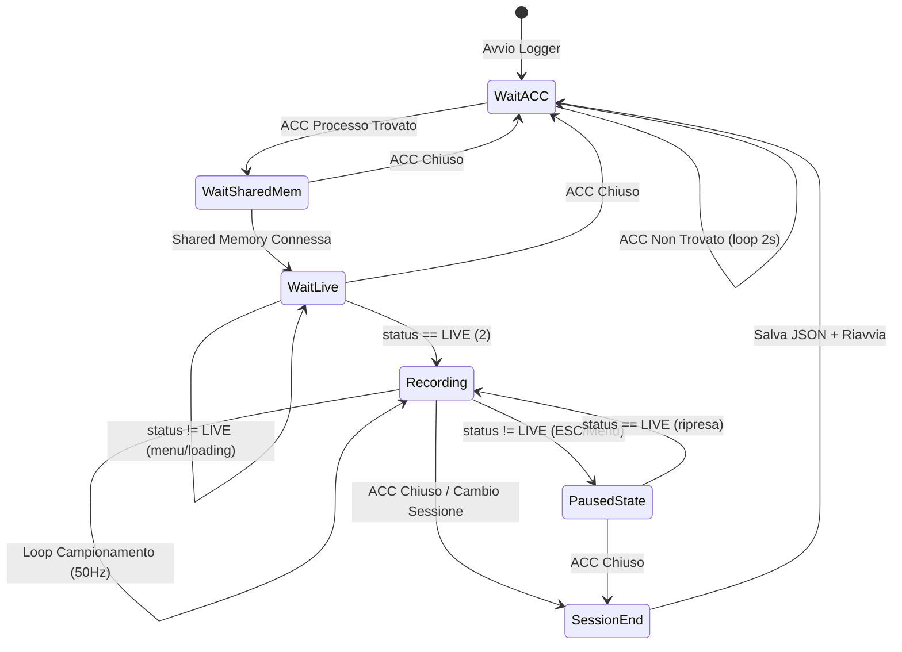
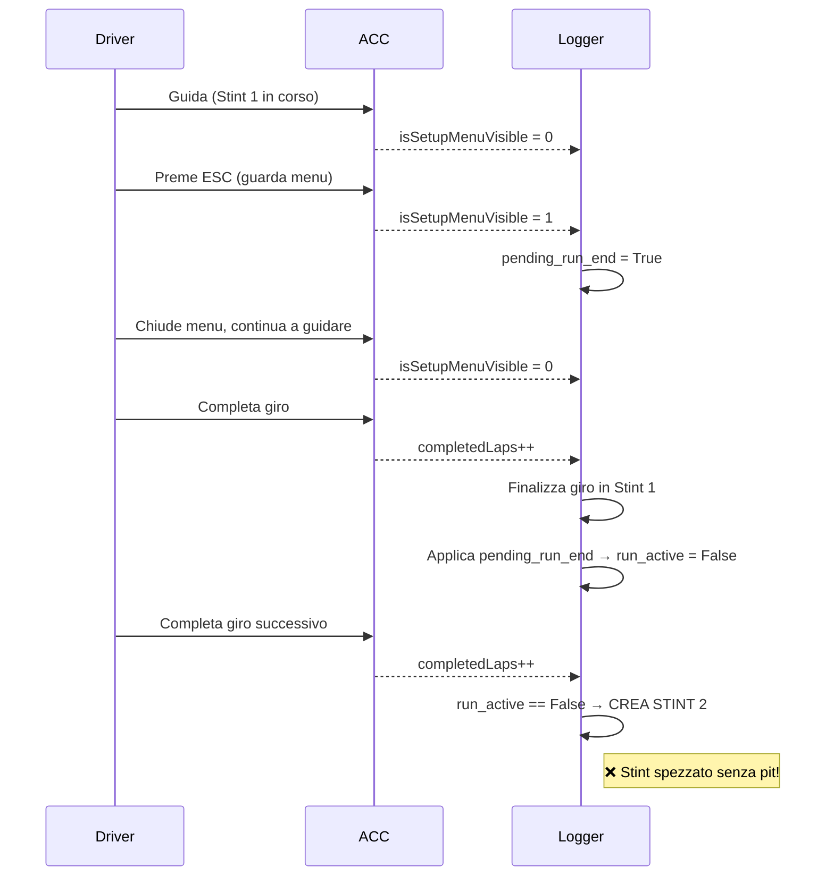
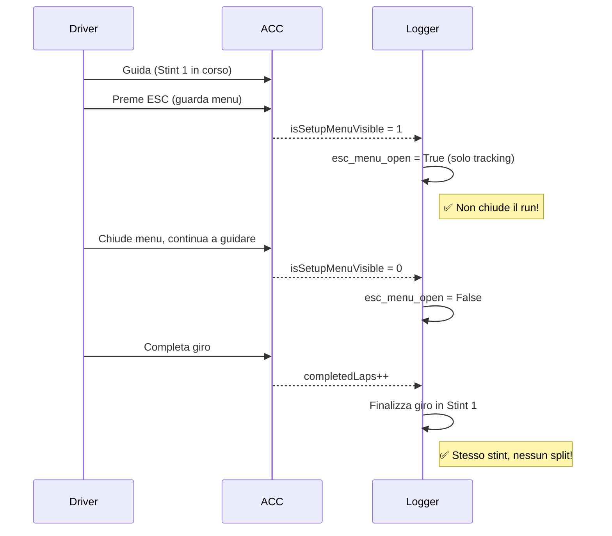

# ACC Telemetry Logger - Architettura e Schema di Flusso

> Documento tecnico approfondito sul funzionamento del Logger ACC.  
> Versione: 1.0  
> Data: 2026-01-22

---

## Panoramica

Il **ACC Telemetry Logger** è un processo Python che:
1. Monitora la presenza del processo ACC (Assetto Corsa Competizione)
2. Si connette alla Shared Memory di ACC
3. Registra dati telemetrici (giri, settori, stint) in file JSON
4. Gestisce automaticamente sessioni multiple e cambi sessione

---

## Schema di Flusso Principale



---

## Modello "run_active" - Gestione Stint

### Concetto Chiave
Lo stato `run_active` indica se l'utente sta **attivamente guidando**:
- `run_active = True` → Stint in corso, giri registrati nello stint corrente
- `run_active = False` → Pausa, il prossimo giro creerà un nuovo stint

### Trigger che CHIUDONO un Run (run_active → False)

| Evento | Codice | Descrizione |
|--------|--------|-------------|
| **Pausa/Menu** | `status != 2` | Sessione in pausa o menu principale |
| **ESC Premuto** | `isSetupMenuVisible == 1` | Menu impostazioni visibile ⚠️ |
| **Entrata Pit Box** | `isInPit == 1` | Entrata nel box (pending, applica dopo lap) |

### Trigger che APRONO un Run (run_active → True)

| Evento | Codice | Descrizione |
|--------|--------|-------------|
| **Primo Giro Completato** | `completedLaps > last` quando `run_active == False` | Crea stint + salva giro |

---

## ⚠️ Problema ESC - Analisi Dettagliata

### Comportamento Attuale (Problematico)



### Problema
Quando l'utente:
1. Preme ESC per guardare le impostazioni
2. Chiude il menu e continua a guidare
3. Completa il giro

Il logger crea un **nuovo stint** invece di continuare quello esistente.

### Comportamento Desiderato



### Regola Corretta per Chiusura Stint

Un run dovrebbe essere chiuso **SOLO** quando:

1. **Entrata effettiva ai box** (`isInPit == 1`) → Il pilota si ferma per pit stop
2. **Uscita dalla sessione** (`status != 2` per più di N secondi) → Cambio sessione o fine
3. **ESC + Ritorno ai Pit** → L'utente preme ESC e sceglie "Torna ai Box"

Un run **NON** dovrebbe essere chiuso quando:
- L'utente preme ESC solo per guardare le impostazioni
- L'utente mette in pausa momentaneamente il gioco

---

## Ciclo di Vita Stint - Schema Completo

### Caso 1: Guida Continua (Nessun Pit)

```
SESSIONE INIZIO
    │
    ▼
[run_active = False]
    │
    ▼
Giro 1 Completato
    │
    ├──▶ Crea Stint 1
    └──▶ [run_active = True]
    │
    ▼
Giro 2, 3, 4... (tutti nello Stint 1)
    │
    ▼
Fine Sessione → Salva JSON
```

### Caso 2: Pit Stop Reale

```
Stint 1 in corso (run_active = True)
    │
    ▼
Pilota entra in pit lane
    │
    ▼
Pilota entra nel box (isInPit = 1)
    │
    ├──▶ pending_run_end = True
    │
    ▼
Giro completato (passaggio traguardo da pit lane)
    │
    ├──▶ Finalizza giro con has_pit_stop = True
    └──▶ Applica pending → [run_active = False]
    │
    ▼
Pilota esce dal box (isInPit = 0)
    │
    ├──▶ next_lap_pit_out = True
    │
    ▼
Esce dalla pit lane (isInPitLane = 0)
    │
    ├──▶ Determina tipo stint (Fuel >= 21L → Race, < 21L → Qualify)
    │
    ▼
Primo giro dopo pit completato
    │
    ├──▶ Crea Stint 2
    └──▶ [run_active = True]
```

### Caso 3: ESC Menu (Comportamento CORRETTO da implementare)

```
Stint 1 in corso (run_active = True)
    │
    ▼
Pilota preme ESC (isSetupMenuVisible = 1)
    │
    ├──▶ esc_pause_start = timestamp (SOLO TRACKING)
    │    ❌ NON setta pending_run_end!
    │
    ▼
Pilota chiude menu (isSetupMenuVisible = 0)
    │
    ├──▶ esc_pause_start = None (reset)
    │
    ▼
Pilota completa giro
    │
    ├──▶ Giro salvato in Stint 1
    └──▶ [run_active = True] (invariato)
    │
    ▼
Stint continua normalmente... ✅
```

---

## Classificazione Stint

### Logica Attuale

La classificazione avviene al momento dell'uscita dalla pit lane (`PIT_LANE_EXIT`):

```python
fuel_at_pit_out = physics.fuel
stint_type = "Race" if fuel_at_pit_out >= 21 else "Qualify"
```

| Fuel | Tipo Stint |
|------|------------|
| >= 21L | Race |
| < 21L | Qualify |

### Primo Stint (Senza Pit)

Se il primo stint inizia senza passare dal pit:
- Usa il fuel al momento della creazione stint
- Stessa logica: >= 21L = Race, < 21L = Qualify

---

## Dati Registrati per Giro

```json
{
  "lap_number": 5,
  "lap_time_ms": 91597,
  "elapsed_time_ms": 459662,
  "fuel_start": 90.23,
  "fuel_remaining": 87.77,
  "air_temp": 36.0,
  "road_temp": 47.0,
  "rain_intensity": "No Rain",
  "track_grip_status": "Optimum",
  "is_valid": true,
  "is_first_stint_lap": false,
  "has_pit_stop": false,
  "pit_out_lap": false,
  "sectors_reliable": true,
  "sector_times_ms": [33297, 35063, 23612]
}
```

### Flag Speciali

| Flag | Significato |
|------|-------------|
| `is_first_stint_lap` | Primo giro dello stint |
| `has_pit_stop` | Giro con sosta effettiva nel box |
| `pit_out_lap` | Giro immediatamente dopo uscita box |
| `sectors_reliable` | Settori calcolati correttamente (no pit, no outlap) |

---

## Edge Cases

### 1. Lag/Freeze del Gioco
Se vengono persi giri (gap in `completedLaps`), vengono inseriti **phantom laps**:
```python
if missed_laps > 0:
    for i in range(missed_laps):
        self._add_phantom_lap(missing_lap_num)
```

### 2. Cambio Auto/Pista
Se durante la sessione cambiano `carModel` o `track`:
- Salva sessione corrente
- Inizializza nuova sessione

### 3. Spectator Mode (Multiplayer Endurance)
Se dopo un pit stop il grip è "Unknown" per 2+ giri consecutivi:
- Logger entra in `spectator_mode`
- Giri non vengono registrati (ride-along)

---

## Prossimi Passi - Fix ESC

### Modifica Proposta

**Rimuovere** il trigger `isSetupMenuVisible` dalla chiusura run:

```python
# RIMUOVERE QUESTO BLOCCO:
if graphics.isSetupMenuVisible == 1:
    if self.run_active and not self.pending_run_end:
        logger.info("[RUN_END_PENDING] ESC/menu -> chiudo run dopo LAP_COMPLETED.")
        self.pending_run_end = True
```

**Sostituire con** tracking senza effetti:

```python
# Solo tracking, nessun effetto sul run
if graphics.isSetupMenuVisible == 1 and not self.esc_menu_visible:
    logger.info("[ESC_MENU] Menu aperto (nessun effetto su stint)")
    self.esc_menu_visible = True
elif graphics.isSetupMenuVisible == 0 and self.esc_menu_visible:
    logger.info("[ESC_MENU] Menu chiuso (ripresa guida)")
    self.esc_menu_visible = False
```

### Quando Chiudere il Run?

1. **`isInPit == 1`** → Entrata box reale (rimane valido)
2. **`status != 2`** per debounce di 2-3 secondi → Uscita reale dalla sessione

---

## Riferimenti Codice

| Funzione | Linea | Descrizione |
|----------|-------|-------------|
| `initialize_session()` | 552 | Inizializza nuova sessione |
| `_create_stint()` | 638 | Crea nuovo stint |
| `_finalize_lap()` | 753 | Finalizza e salva giro |
| `run()` | 967 | Loop principale |
| ESC trigger (da rimuovere) | 1120-1126 | Chiusura run su ESC |
