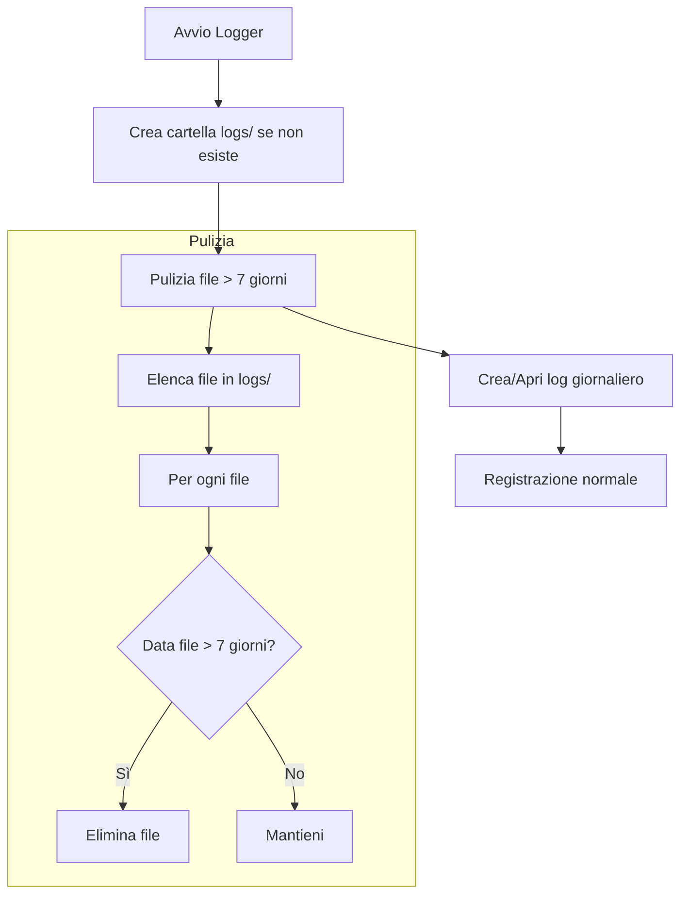

# Sistema di Logging - Proposta di Implementazione

> Documento di design per il sistema di logging con rotazione 7 giorni.  
> Data: 2026-01-22

---

## Stato Attuale

### Logger Python (acc_telemetry_logger.py)

Attualmente **esiste** un sistema di logging base:

```python
# Linee 47-61
LOG_FILE = os.path.join(_log_base_dir, "logger.log")

logging.basicConfig(
    level=logging.INFO,
    format='%(asctime)s | %(levelname)s | %(message)s',
    handlers=[
        logging.StreamHandler(),           # Output console
        logging.FileHandler(LOG_FILE, encoding='utf-8')  # Output file
    ]
)
```

### Problemi Attuali

| Problema | Descrizione |
|----------|-------------|
| **Sovrascrittura** | Il file `logger.log` viene sovrascritto ad ogni avvio |
| **Nessuna rotazione** | I log crescono indefinitamente |
| **Nessuna pulizia** | I log vecchi non vengono eliminati |
| **File singolo** | Difficile navigare log di giorni diversi |

---

## Proposta: Sistema con Rotazione 7 Giorni

### Struttura Cartelle

```
ACC_Suite/
├── logs/                              # Nuova cartella dedicata
│   ├── logger_2026-01-22.log          # Log di oggi
│   ├── logger_2026-01-21.log          # Log di ieri
│   ├── logger_2026-01-20.log          # ...
│   ├── logger_2026-01-19.log
│   ├── logger_2026-01-18.log
│   ├── logger_2026-01-17.log
│   └── logger_2026-01-16.log          # Più vecchio (eliminato domani)
│
├── telemetry_data/                    # Dati sessioni (invariato)
├── versions/                          # Versioni logger
└── ACC_Suite.exe                      # Launcher
```

### Schema di Funzionamento



---

## Implementazione Proposta

### 1. Configurazione Logging (Python)

```python
import os
import logging
from datetime import datetime, timedelta
import glob

# Costanti
LOGS_DIR = "logs"
LOG_RETENTION_DAYS = 7
LOG_FILE_PREFIX = "logger_"
LOG_FILE_SUFFIX = ".log"

def setup_logging(base_dir):
    """
    Configura il sistema di logging con rotazione giornaliera.
    
    Args:
        base_dir: Directory base dell'applicazione
    """
    logs_dir = os.path.join(base_dir, LOGS_DIR)
    
    # 1. Crea cartella logs/ se non esiste
    os.makedirs(logs_dir, exist_ok=True)
    
    # 2. Pulizia file vecchi (> 7 giorni)
    cleanup_old_logs(logs_dir)
    
    # 3. Nome file log di oggi
    today = datetime.now().strftime("%Y-%m-%d")
    log_file = os.path.join(logs_dir, f"{LOG_FILE_PREFIX}{today}{LOG_FILE_SUFFIX}")
    
    # 4. Configura logging
    logging.basicConfig(
        level=logging.INFO,
        format='%(asctime)s | %(levelname)s | %(message)s',
        handlers=[
            logging.StreamHandler(),  # Console
            logging.FileHandler(log_file, encoding='utf-8', mode='a')  # Append
        ]
    )
    
    return logging.getLogger("ACC_Logger")


def cleanup_old_logs(logs_dir):
    """
    Elimina i file di log più vecchi di LOG_RETENTION_DAYS giorni.
    """
    cutoff_date = datetime.now() - timedelta(days=LOG_RETENTION_DAYS)
    pattern = os.path.join(logs_dir, f"{LOG_FILE_PREFIX}*{LOG_FILE_SUFFIX}")
    
    for log_file in glob.glob(pattern):
        try:
            # Estrai data dal nome file (logger_2026-01-22.log)
            filename = os.path.basename(log_file)
            date_str = filename.replace(LOG_FILE_PREFIX, "").replace(LOG_FILE_SUFFIX, "")
            file_date = datetime.strptime(date_str, "%Y-%m-%d")
            
            if file_date < cutoff_date:
                os.remove(log_file)
                print(f"[LOG_CLEANUP] Eliminato: {filename}")
        except (ValueError, OSError) as e:
            # Ignora file con formato data invalido
            pass
```

### 2. Integrazione nel Logger

Sostituire il blocco di configurazione attuale:

```python
# PRIMA (Linee 47-61)
LOG_FILE = os.path.join(_log_base_dir, "logger.log")
logging.basicConfig(...)

# DOPO
logger = setup_logging(_log_base_dir)
```

### 3. Stesso Sistema per il Launcher

Il launcher può usare lo stesso approccio:

```python
# launcher.py
from log_setup import setup_logging

logger = setup_logging(os.path.dirname(os.path.abspath(__file__)))
```

---

## Formato Log

### Console (Invariato)
```
2026-01-22 15:35:59,776 | INFO | [OK] Connesso alla shared memory di ACC
```

### File
```
2026-01-22 15:35:59,776 | INFO | [OK] Connesso alla shared memory di ACC
2026-01-22 15:35:59,780 | INFO | ============================================================
2026-01-22 15:35:59,780 | INFO |   SESSIONE INIZIATA
2026-01-22 15:35:59,780 | INFO |   Tracciato: Valencia
2026-01-22 15:35:59,780 | INFO |   Vettura:   ford_mustang_gt3
2026-01-22 15:35:59,780 | INFO |   Pilota:    Edoardo Baldi [RME]
```

---

## Alternative Considerate

### 1. TimedRotatingFileHandler (Python Built-in)

```python
from logging.handlers import TimedRotatingFileHandler

handler = TimedRotatingFileHandler(
    "logger.log",
    when="midnight",
    interval=1,
    backupCount=7
)
```

**Pro**: Semplice, built-in
**Contro**: Funziona solo se il processo è sempre attivo (non per riavvii frequenti)

### 2. RotatingFileHandler (Per Dimensione)

```python
from logging.handlers import RotatingFileHandler

handler = RotatingFileHandler(
    "logger.log",
    maxBytes=5*1024*1024,  # 5MB
    backupCount=5
)
```

**Pro**: Limita dimensione
**Contro**: Non organizzato per data

### Scelta Consigliata

**Log giornalieri con pulizia all'avvio** perché:
- Funziona con riavvii frequenti
- Organizzato per data (facile debugging)
- Pulizia automatica senza dipendere dal processo attivo
- Robusto per scenari reali

---

## Checklist Implementazione

- [ ] Creare modulo `log_setup.py` con funzioni `setup_logging()` e `cleanup_old_logs()`
- [ ] Integrare nel Logger Python
- [ ] Integrare nel Launcher
- [ ] Testare:
  - [ ] Creazione cartella `logs/`
  - [ ] Creazione file giornaliero
  - [ ] Append su riavvio stesso giorno
  - [ ] Nuovo file per nuovo giorno
  - [ ] Pulizia file > 7 giorni
- [ ] Documentare nel README

---

## Esempio Output Atteso

### Primo Avvio (22 Gennaio)

```
ACC_Suite/
└── logs/
    └── logger_2026-01-22.log    # Creato
```

### 7 Giorni Dopo (29 Gennaio)

```
ACC_Suite/
└── logs/
    ├── logger_2026-01-29.log    # Oggi
    ├── logger_2026-01-28.log
    ├── logger_2026-01-27.log
    ├── logger_2026-01-26.log
    ├── logger_2026-01-25.log
    ├── logger_2026-01-24.log
    └── logger_2026-01-23.log    # 7° giorno (domani eliminato)
    
    # logger_2026-01-22.log → ELIMINATO (> 7 giorni)
```

---

## Note Implementative

### Windows File Locking

Su Windows, il file log corrente potrebbe essere in uso:
- Usare `mode='a'` (append) invece di `mode='w'`
- La pulizia elimina solo file di giorni passati (mai quello di oggi)

### Gestione Errori

```python
def cleanup_old_logs(logs_dir):
    for log_file in glob.glob(pattern):
        try:
            os.remove(log_file)
        except PermissionError:
            # File in uso (es. da un vecchio processo)
            logger.warning(f"[LOG_CLEANUP] Impossibile eliminare: {log_file}")
        except Exception as e:
            logger.warning(f"[LOG_CLEANUP] Errore: {e}")
```

### Dimensione Stimata

- Un giorno di log tipico: ~50-200 KB
- 7 giorni: ~350 KB - 1.4 MB
- Trascurabile per il disco
