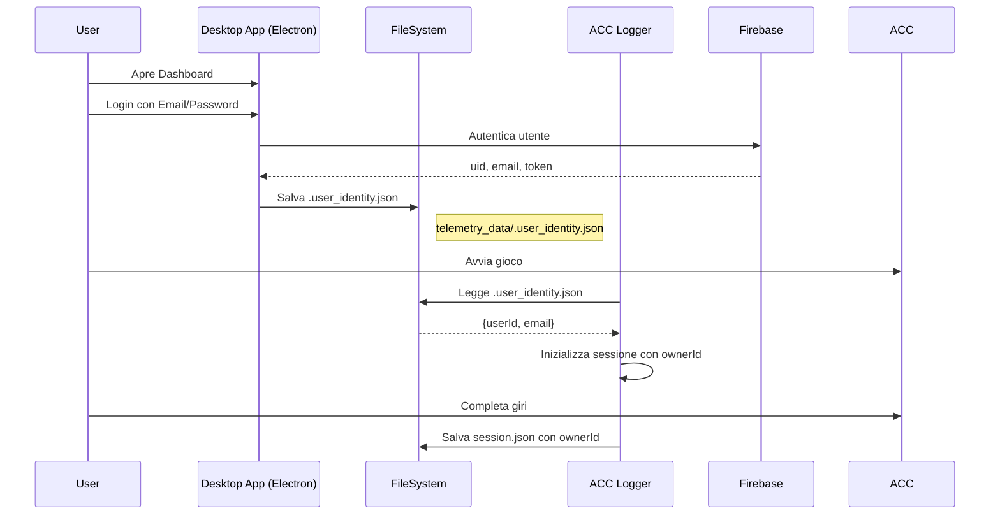

# Problema ownerId Null - Analisi e Soluzione

> Documento di analisi sul problema ownerId mancante nei JSON delle sessioni.  
> Data: 2026-01-22

---

## Il Problema

Nel JSON della sessione di un utente, i campi owner sono vuoti:

```json
{
  "ownerId": null,
  "ownerEmail": null
}
```

Questo impedisce:
1. L'associazione della sessione all'utente su Firebase
2. La visualizzazione nella dashboard dell'utente
3. La sincronizzazione automatica

---

## Come Funziona il Sistema di Identità

### Flusso Normale (Schema)



### File .user_identity.json

Struttura del file:
```json
{
  "userId": "abc123def456",
  "email": "user@example.com",
  "savedAt": "2026-01-22T15:00:00.000Z"
}
```

**Posizione**: `telemetry_data/.user_identity.json`

---

## Cause del Problema ownerId Null

### Causa 1: File .user_identity.json Non Esiste ⭐ PIÙ PROBABILE

**Scenario**: L'utente ha:
1. Creato account su Firebase (via web o app)
2. **NON** ha mai fatto login tramite l'app Desktop

**Perché succede**:
- Il file `.user_identity.json` viene creato **SOLO** dall'app Electron Desktop
- Se l'utente usa solo la versione web, non esiste modo di creare il file
- Il Logger Python cerca il file, non lo trova, imposta `ownerId = None`

```python
# acc_telemetry_logger.py - Linea 384-395
def _load_user_identity(self):
    identity_path = os.path.join(self.output_dir, ".user_identity.json")
    try:
        if os.path.exists(identity_path):  # ❌ File non esiste
            # ...
    return None  # → ownerId sarà null
```

### Causa 2: Login Prima dell'Avvio del Logger

**Scenario**: L'utente ha:
1. Avviato il Logger (senza login)
2. Iniziato a guidare
3. Fatto login dopo (file viene creato dopo)

**Perché succede**:
- Il Logger **rilegge** user_identity solo all'inizio di ogni sessione
- Se il login avviene DOPO l'inizio della registrazione, quella sessione avrà ownerId null

```python
# acc_telemetry_logger.py - Linea 565
# Il reload avviene SOLO in initialize_session()
self.user_identity = self._load_user_identity()
```

### Causa 3: Percorso telemetry_data Diverso

**Scenario**: Il file identity esiste ma in una cartella diversa.

L'app Electron usa:
```javascript
// main.js - Linea 331
const identityPath = path.join(TELEMETRY_PATH, '.user_identity.json');
```

Il Logger Python usa:
```python
# acc_telemetry_logger.py - Linea 362
self.output_dir = os.path.join(base_dir, output_dir)
```

Se i percorsi non coincidono, il Logger non trova il file.

### Causa 4: Email Non Verificata (NON È LA CAUSA)

La verifica email **NON** influisce sulla creazione del file identity:
- Il file viene creato al **login**, non alla verifica
- Un utente con email non verificata può comunque fare login
- Il campo `emailVerified` in Firebase è separato dal sistema identity

---

## Come Verificare la Causa

### Step 1: Controllare se il File Esiste

Chiedi all'utente di verificare se esiste:
```
telemetry_data\.user_identity.json
```

Nella cartella dove si trova il Logger (es. `ACC_Suite/telemetry_data/`).

### Step 2: Se Non Esiste

L'utente deve:
1. Aprire l'app Desktop (Electron)
2. Fare **Login** con le sue credenziali
3. Verificare che il file sia stato creato

### Step 3: Se Esiste ma ownerId è Null

Verificare il contenuto del file:
```json
{
  "userId": "...",   // Deve essere presente
  "email": "...",    // Deve essere presente
  "savedAt": "..."
}
```

---

## Soluzioni

### Soluzione Immediata (Per l'Utente)

1. **Aprire la Dashboard Desktop**
2. **Fare Login** con email e password
3. **Verificare** che appaia il messaggio `[IDENTITY] Saved user identity: email@...`
4. **Riavviare il Logger** se era già in esecuzione
5. Le **nuove sessioni** avranno ownerId corretto

### Soluzione per le Sessioni Esistenti

Le sessioni già create con `ownerId: null` possono essere corrette manualmente:

```json
{
  "ownerId": "uid_utente_firebase",
  "ownerEmail": "email@utente.com"
}
```

### Soluzione Tecnica (Fix nel Codice)

**Opzione A**: Reload identity ad ogni giro
```python
# In _finalize_lap() - aggiunge reload identity
if not self.user_identity:
    self.user_identity = self._load_user_identity()
    if self.user_identity:
        self.session_data["ownerId"] = self.user_identity.get("userId")
        self.session_data["ownerEmail"] = self.user_identity.get("email")
```

**Opzione B**: Watch file changes (più complesso)
- Usare `watchdog` per monitorare cambiamenti al file
- Ricaricare identity quando il file viene creato/modificato

---

## Domande Frequenti

### "Se metto emailVerified = true su Firebase, risolvo?"

**No**, la verifica email non influisce sul sistema identity:
- Il file `.user_identity.json` viene creato al **login** (non alla verifica)
- Un utente può fare login anche senza verificare l'email
- La causa più probabile è che l'utente non ha mai fatto login dalla Desktop App

### "Perché ownerId è obbligatorio?"

Non è strettamente obbligatorio, ma senza ownerId:
- La sessione non è associata all'utente
- Non appare nella dashboard dell'utente
- Il sync automatico non funziona
- Il sistema considera il file come "pre-login session"

### "Cosa succede se carico un file senza ownerId?"

```javascript
// useElectronSync.ts - Linea 261-262
if (!fileOwnerId) {
    console.log(`[SYNC] Warning: ${fileName} has no ownerId (pre-login session)`)
}
```

Il file viene comunque processato, ma con warning.

---

## Check Tecnico Firebase

Per verificare lo stato dell'utente in Firebase:

1. Vai su **Firebase Console** → **Authentication** → **Users**
2. Cerca l'utente per email
3. Controlla:
   - **User UID**: Questo è il valore che dovrebbe essere in `ownerId`
   - **Email verified**: Se è `false`, l'email non è verificata (ma non causa il problema)
   - **Sign-in date**: Verifica se l'utente ha mai fatto login

### Impostare emailVerified = true

Puoi farlo da Firebase Console o via Admin SDK:

```javascript
// Firebase Admin SDK
admin.auth().updateUser(uid, { emailVerified: true })
```

**Ma questo NON risolve il problema ownerId** - serve solo se vuoi permettere funzionalità riservate a utenti verificati.
