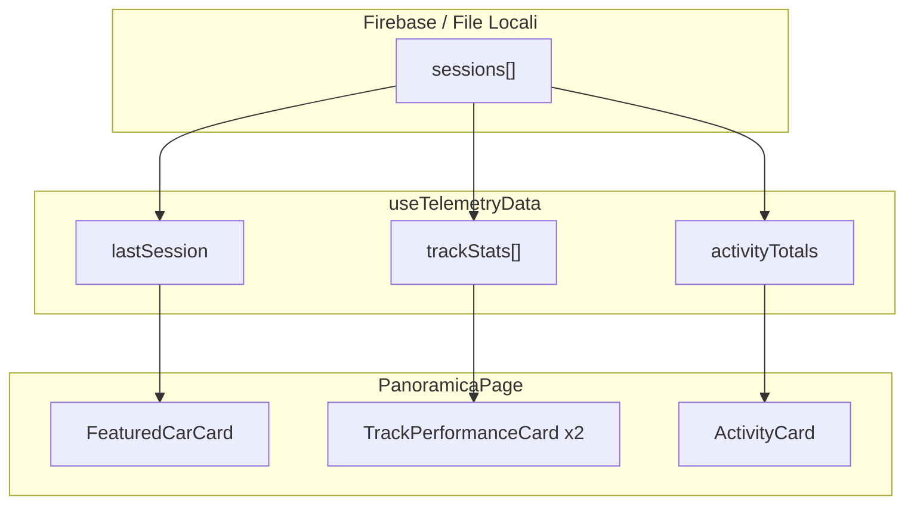

# Schermata PANORAMICA - Analisi Struttura e Dati

**Applicazione**: ACC Suite  
**Versione documento**: 1.1  
**Data**: 2026-01-19  
**Ultimo aggiornamento**: Aggiunta formattazione ore per durate >= 60min, copertura completa immagini auto GT3

---

## 1. STRUTTURA GENERALE DELLA SCHERMATA

### Layout
La schermata Panoramica utilizza un **grid 2x2** che occupa l'area principale.

| Posizione | Componente | Scopo |
|-----------|------------|-------|
| Alto Sinistra | FeaturedCarCard | Ultima auto utilizzata |
| Alto Destra | TrackPerformanceCard | Ultima pista |
| Basso Sinistra | ActivityCard | Attività ultimi 7 giorni |
| Basso Destra | TrackPerformanceCard | Penultima pista |

### Elementi Condivisi
- **Header**: Navbar con logo, tabs (Panoramica/Sessioni/Piste), user dropdown
- **Layout**: `LayoutPageContainer` (wrapper standard)
- **Sidebar**: Presente solo in layout coach (non in panoramica pilota)

---

## 2. SEZIONI E DATI DINAMICI

---

### SEZIONE 1: ULTIMA AUTO (FeaturedCarCard)

**Posizione**: Alto sinistra  
**Scopo**: Mostra l'auto utilizzata nell'ultima sessione registrata

| Nome FE | Tipo | Natura | Fonte | Percorso JSON | Note |
|---------|------|--------|-------|---------------|------|
| **Nome Auto** | Testo | Calcolato | Firebase | `sessions[0].meta.car` | Formattato via `formatCarName()` |
| **Immagine Auto** | Immagine | Mappato | Statico | - | 16 immagini GT3 disponibili con 45+ keyword di matching |
| **Sottotitolo** | Testo | Statico | - | - | Fisso: "Ultima auto utilizzata" |
| **Data** | Testo | Calcolato | Firebase | `sessions[0].meta.date_start` | Formattato: `18 Gen 2026` |

#### Immagini Auto Disponibili (16)

| Marca | File | Keyword Matching |
|-------|------|------------------|
| Ford | `mustang_gt3.png` | mustang, ford_mustang |
| Aston Martin | `aston_martin_gt3.png` | amr, aston, v8_vantage, v12_vantage |
| Ferrari 296 | `ferrari_296_gt3.png` | ferrari_296, 296_gt3 |
| Ferrari 488 | `ferrari_488_gt3.png` | ferrari_488, 488_gt3, 488 |
| BMW | `bmw_m4_gt3.png` | bmw, m4, m6 |
| McLaren | `mclaren_720s_gt3.png` | mclaren, 720s, 650s |
| Audi | `audi_r8_gt3.png` | audi, r8, r8_lms |
| Bentley | `bentley_continental_gt3.png` | bentley, continental |
| Honda | `honda_nsx_gt3.png` | honda, nsx |
| Lamborghini | `lamborghini_huracan_gt3.png` | lamborghini, huracan |
| Mercedes | `mercedes_amg_gt3.png` | mercedes, amg, amg_gt |
| Porsche | `porsche_911_gt3.png` | porsche, 911, 991, 992 |
| Nissan | `nissan_gtr_gt3.png` | nissan, gtr, gt-r, nismo |
| Lexus | `lexus_rcf_gt3.png` | lexus, rcf, rc_f |
| Jaguar | `jaguar_gt3.png` | jaguar, emil_frey |
| Default | `default_gt3.png` | Fallback se nessun match |

---

### SEZIONE 2: ULTIMA PISTA (TrackPerformanceCard)

**Posizione**: Alto destra  
**Scopo**: Mostra prestazioni sulla pista più recente

| Nome FE | Tipo | Unità | Natura | Fonte | Percorso JSON |
|---------|------|-------|--------|-------|---------------|
| **BEST QUALY** | Tempo | m:ss.ms | Aggregato | Firebase | `trackStats[0].bestQualy` |
| **BEST RACE** | Tempo | m:ss.ms | Aggregato | Firebase | `trackStats[0].bestRace` |
| **AVG TIME** | Tempo | m:ss.ms | Aggregato | Firebase | `trackStats[0].bestAvgRace` |
| **Nome Pista** | Testo | - | Calcolato | Firebase | `trackStats[0].track` |
| **Immagine Pista** | Immagine | - | Mappato | Statico | - |

---

### SEZIONE 3: ATTIVITÀ (ActivityCard)

**Posizione**: Basso sinistra  
**Scopo**: Visualizza il tempo dedicato per tipo sessione negli ultimi 7 giorni

#### Grafico a Barre Impilate

| Dato | Colore | Fonte |
|------|--------|-------|
| **Practice** | Blu (#03A9F4) | `session.summary.totalTime` per session_type=0 |
| **Qualify** | Giallo (#FFC107) | `session.summary.totalTime` per session_type=1 |
| **Race** | Rosso (#E10600) | `session.summary.totalTime` per session_type=2 |

#### Legenda Riepilogo - Formattazione Durata

| Minuti | Formato Display | Esempio |
|--------|-----------------|---------|
| < 60 | `Xmin` | `35min` |
| = 60 | `Xh` | `1h` |
| > 60 | `Xh YY` | `4h 08` |

```typescript
// formatDuration() - logica formattazione
if (minutes >= 60) {
  const hours = Math.floor(minutes / 60)
  const mins = minutes % 60
  if (mins === 0) return `${hours}h`
  return `${hours}h ${mins.toString().padStart(2, '0')}`
}
return `${minutes}min`
```

---

### SEZIONE 4: PENULTIMA PISTA (TrackPerformanceCard)

**Posizione**: Basso destra  
**Scopo**: Mostra prestazioni sulla seconda pista più recente

> Stessa struttura di "Ultima pista" ma usa `sortedTrackStats[1]`

---

## 3. MAPPA DATI COMPLETA



---

## 4. CONTESTO DI VALIDITÀ DEI DATI

| Dato | Contesto Temporale | Note |
|------|-------------------|------|
| Ultima Auto | Ultima sessione | Nessun filtro temporale |
| Best Qualy/Race/Avg | STORICO COMPLETO | Aggregato su TUTTE le sessioni |
| Attività | Ultimi 7 giorni | Finestra mobile |

---

## 5. DA CONFERMARE

| Elemento | Stato |
|----------|-------|
| ✅ Immagini auto | Copertura completa (16 auto GT3) |
| ✅ Formattazione ore | Implementata per >= 60min |
| session_type valori | Confermare: 0=Practice, 1=Qualify, 2=Race |

---

## 6. RIFERIMENTI FILE

| File | Scopo |
|------|-------|
| `components/pages/PanoramicaPage.vue` | Componente principale |
| `composables/useTelemetryData.ts` | Logica dati |
| `components/cards/ActivityCard.vue` | Card attività con formatDuration() |
| `assets/images/cars/` | 16 immagini auto GT3 |

