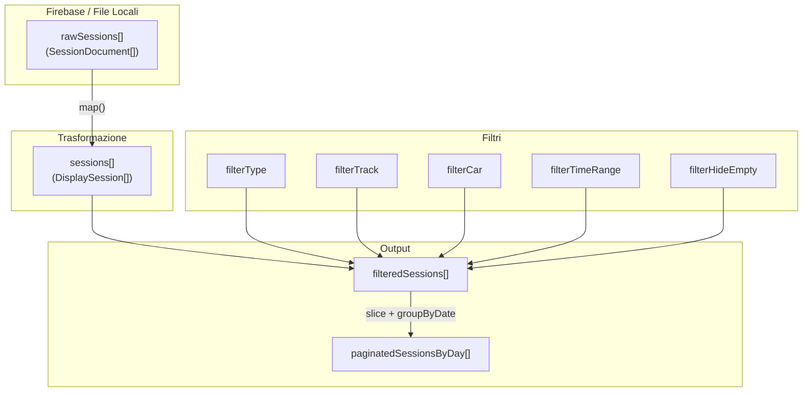

# Schermata SESSIONI - Analisi Struttura e Dati

**Applicazione**: ACC Suite  
**Versione documento**: 1.0  
**Data**: 2026-01-19  

---

## 1. STRUTTURA GENERALE DELLA SCHERMATA

### Layout
La schermata Sessioni presenta un elenco di tutte le sessioni dell'utente, con **filtri avanzati** e due modalità di visualizzazione (Lista/Card).

| Area | Componente | Descrizione |
|------|------------|-------------|
| Header | PageTitle | Titolo fisso "SESSIONI" |
| Filtri | FilterBar | Tipo, pista, auto, periodo, nascondi vuote |
| Contenuto | SessionList / SessionCards | Sessioni raggruppate per data |
| Footer | PaginationControls | Navigazione pagine |

### Elementi Condivisi
- **Header app**: Navbar con logo, tabs, user dropdown  
- **Layout**: `LayoutPageContainer`

---

## 2. SEZIONI E DATI DINAMICI

---

### SEZIONE 1: BARRA FILTRI

**Posizione**: Sotto il titolo  
**Scopo**: Permettere all'utente di cercare sessioni specifiche

| Filtro | Tipo UI | Opzioni | Default | Comportamento |
|--------|---------|---------|---------|---------------|
| **Tipo sessione** | Segmented | Tutto/Practice/Qualify/Race | Tutto | Filtra per `session.type` |
| **Pista** | Select | Tutte + lista dinamica | Tutte | Filtra per `session.track` |
| **Auto** | Select | Tutte + lista dinamica | Tutte | Filtra per `session.car` |
| **Periodo** | Segmented | Oggi/7g/30g/Tutto | Tutto | Filtra per `session.date` |
| **Nascondi vuote** | Toggle | On/Off | Off | Esclude `lapsValid === 0` |
| **Vista** | Toggle iconico | Lista/Card | Lista | Cambia layout |

#### Fonte dati filtri

| Filtro | Fonte |
|--------|-------|
| Piste | `[...new Set(sessions.map(s => s.track))]` - Estratte dinamicamente |
| Auto | `[...new Set(sessions.map(s => s.car))]` - Estratte dinamicamente |

---

### SEZIONE 2: RAGGRUPPAMENTO GIORNALIERO

**Posizione**: Contenuto principale  
**Scopo**: Organizzare le sessioni per data

| Dato | Tipo | Natura | Fonte | Logica |
|------|------|--------|-------|--------|
| **Data header** | Testo | Calcolato | Firebase | `session.meta.date_start` formattato "18 GENNAIO 2026" |
| **Conteggio sessioni** | Numero | Conteggio | Runtime | `group.sessions.length` |

---

### SEZIONE 3: RIGA SESSIONE (per ogni sessione)

**Scopo**: Mostrare informazioni chiave per identificare e valutare ogni sessione

| Nome FE | Tipo | Natura | Fonte | Percorso JSON | Logica |
|---------|------|--------|-------|---------------|--------|
| **Tipo** (chip) | Badge | Raw | Firebase | `session.meta.session_type` | 0=Practice, 1=Qualify, 2=Race via `getSessionTypeLabel()` |
| **Ora** | Testo | Calcolato | Firebase | `session.meta.date_start` | Estratto `HH:MM` via `formatTime()` |
| **Pista** | Testo | Calcolato | Firebase | `session.meta.track` | Formattato via `formatTrackName()` |
| **Auto** | Testo | Calcolato | Firebase | `session.meta.car` | Formattato via `formatCarName()` |
| **GIRI** | Numero | Raw | Firebase | `session.summary.laps` | Conteggio totale giri |
| **STINT** | Numero | Raw | Firebase | `session.summary.stintCount` | Conteggio stint nella sessione |
| **Q** (tempo) | Tempo | Raw | Firebase | `session.summary.best_qualy_ms` | Miglior giro in stint Qualify, `—` se assente |
| **R** (tempo) | Tempo | Raw | Firebase | `session.summary.best_race_ms` | Miglior giro in stint Race/Practice, `—` se assente |

#### Note sui Badge Tempo

- **Q**: Presente solo se la sessione contiene stint di tipo "Qualify"
- **R**: Presente solo se la sessione contiene stint di tipo "Race" o "Practice"
- Un simbolo `—` indica assenza del dato (nessun giro valido di quel tipo)

---

### SEZIONE 4: PAGINAZIONE

**Posizione**: Fondo pagina  
**Scopo**: Navigare tra pagine di sessioni

| Dato | Tipo | Natura | Logica |
|------|------|--------|--------|
| **Pagina corrente** | Numero | State | `currentPage` (ref Vue) |
| **Totale pagine** | Numero | Calcolato | `ceil(filteredSessions.length / 20)` |
| **Totale sessioni** | Numero | Calcolato | `filteredSessions.length` |

---

## 3. MAPPA DATI COMPLETA



---

## 4. INTERFACCIA DisplaySession

```typescript
interface DisplaySession {
  id: string          // session.sessionId
  date: string        // YYYY-MM-DD (estratto da date_start)
  time: string        // HH:MM
  type: SessionType   // 'practice' | 'qualify' | 'race'
  track: string       // Nome formattato
  car: string         // Nome formattato
  laps: number        // summary.laps
  lapsValid: number   // summary.lapsValid
  stints: number      // summary.stintCount
  bestQualy?: string  // Formattato m:ss.ms o undefined
  bestRace?: string   // Formattato m:ss.ms o undefined
}
```

---

## 5. CONTESTO DI VALIDITÀ DEI DATI

| Dato | Contesto | Note |
|------|----------|------|
| Session list | TUTTE le sessioni utente | Nessun limite temporale in default |
| Filtro temporale | Oggi / 7g / 30g / Tutto | Calcolato rispetto a data odierna |
| lapsValid | Per sessione | Usato per filtro "nascondi vuote" |

---

## 6. RIEPILOGO CRITICO

### Dati Chiave

| Dato | Importanza | Uso |
|------|------------|-----|
| **Tipo sessione** | Alta | Differenzia scopo sessione |
| **Pista** | Alta | Navigazione e filtraggio |
| **GIRI** | Media | Indica quantità lavoro svolto |
| **Q/R tempi** | Alta | Valutazione rapida performance |

### Potenziali Ambiguità

| Aspetto | Ambiguità | Chiarimento |
|---------|-----------|-------------|
| Q vs R | Non chiaro a prima vista | Q = miglior giro in stint Qualify; R = miglior giro in stint Race/Practice |
| Sessione vuota | `lapsValid === 0` | Sessione senza giri completati validi |
| STINT | Potrebbe confondere | Numero di run distinti nella sessione (separati da pit stop) |

---

## 7. DA CONFERMARE

| Elemento | Stato | Azione |
|----------|-------|--------|
| session_type mapping | Documentato | Verificare: 0=Practice, 1=Qualify, 2=Race |
| bestQualy / bestRace | Da stint type | Confermare che provengono da `best_qualy_ms` e `best_race_ms` |
| lapsValid | Conteggio | Verificare criteri per "giro valido" |

---

## 8. RIFERIMENTI FILE

| File | Scopo |
|------|-------|
| `components/pages/SessioniPage.vue` | Componente principale (1133 righe) |
| `composables/useTelemetryData.ts` | Source dei dati sessione |
| `components/ui/PaginationControls.vue` | Controlli paginazione |
