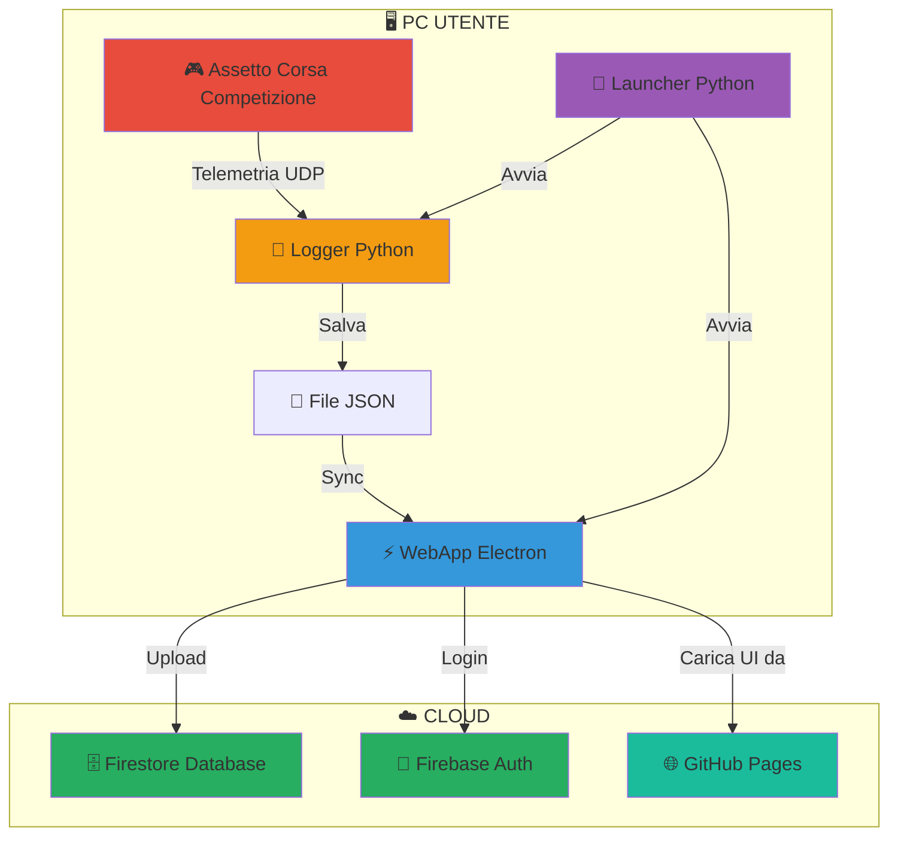
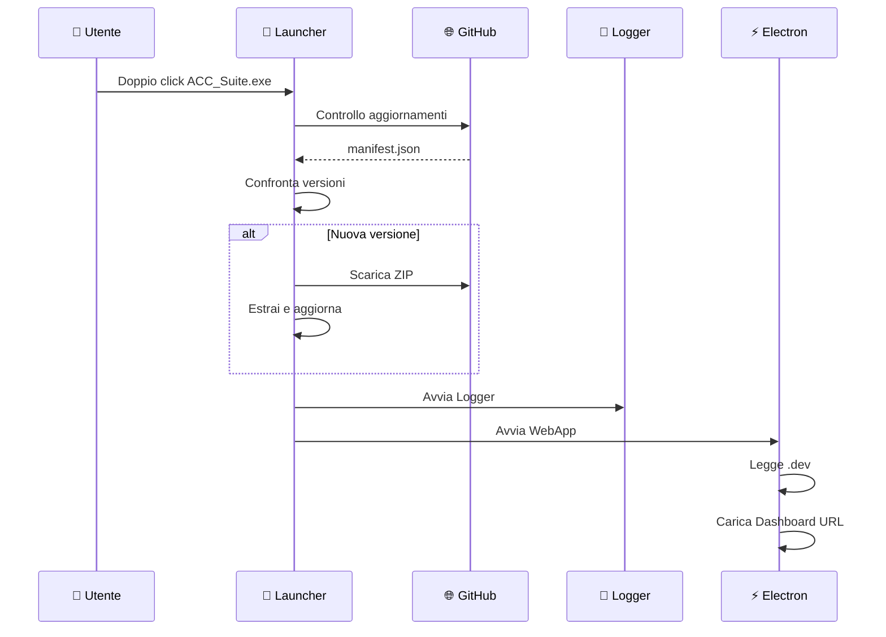
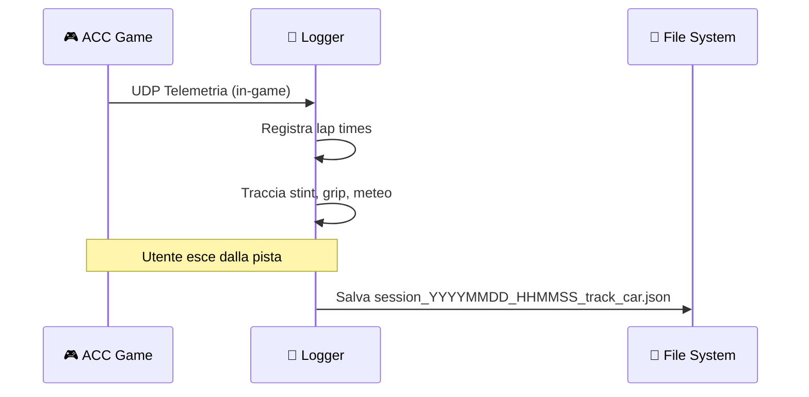
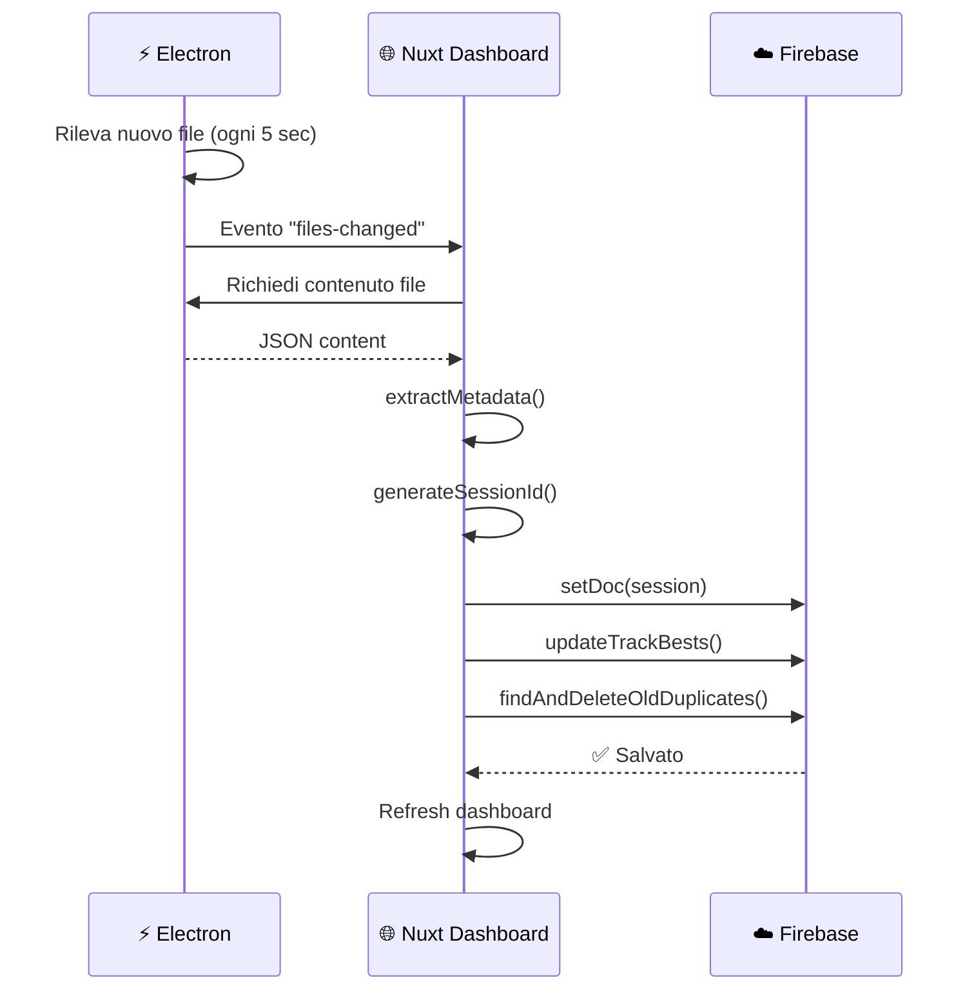
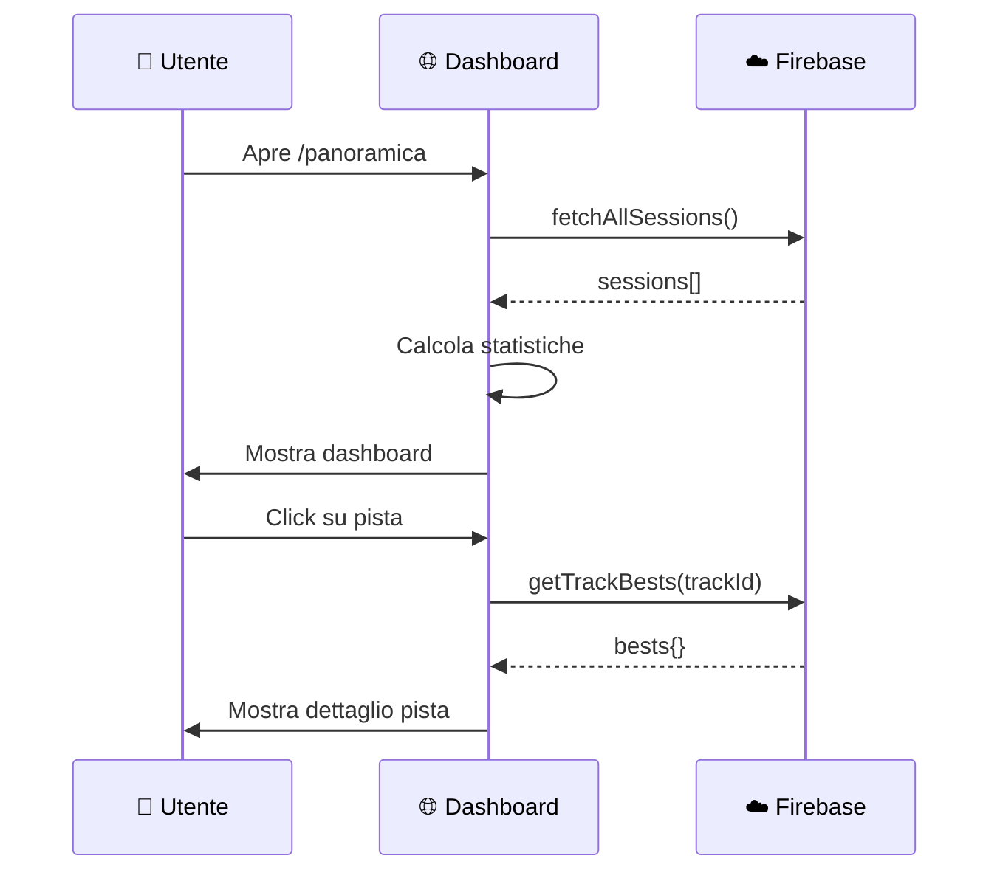

# ACC Telemetry Suite - Architettura Completa

## 📊 Diagramma Generale



---

## 🧩 Componenti del Progetto

### 1. 🚀 LAUNCHER (Python)

| Aspetto | Dettaglio |
|---------|-----------|
| **File** | `D:\...\Nuova cartella (9)\launcher.py` |
| **Linguaggio** | Python |
| **Compilato** | `ACC_Suite.exe` (via PyInstaller) |

#### Ruolo
Il **punto di ingresso** dell'applicazione. L'utente avvia questo e lui gestisce tutto il resto.

#### Cosa Fa
1. **Controlla aggiornamenti** - Legge [manifest.json](file:///D:/Archivio/Desktop/Nuova%20cartella%20%289%29/manifest.json) da GitHub e confronta versioni
2. **Scarica update** - Se c'è una nuova versione, scarica lo ZIP e estrae
3. **Avvia il Logger** - Lancia `acc_telemetry_logger.exe` in background
4. **Avvia la WebApp** - Lancia [ACC-Telemetry.exe](file:///D:/Archivio/Desktop/Nuova%20cartella%20%289%29/webapp/ACC-Telemetry.exe) (Electron)
5. **Gestisce ambiente** - Legge [.dev](file:///D:/Archivio/Desktop/Nuova%20cartella%20%289%29/.dev) per decidere se usare URL dev/prod

#### File Collegati
```
launcher.py              → Sorgente
dist/ACC_Suite.exe       → Compilato
manifest.json            → Versioni PROD
manifest-dev.json        → Versioni DEV
version.json             → Info versione
.dev                     → Flag ambiente (se presente = DEV)
```

---

### 2. 🐍 LOGGER (Python)

| Aspetto | Dettaglio |
|---------|-----------|
| **File** | `D:\...\Nuova cartella (9)\acc_telemetry_logger.py` |
| **Linguaggio** | Python |
| **Compilato** | `acc_telemetry_logger.exe` |

#### Ruolo
Registra i dati telemetrici dal gioco ACC in tempo reale.

#### Cosa Fa
1. **Ascolta UDP** - ACC invia dati telemetrici via UDP (porte 9000, 9001, 9002)
2. **Registra sessioni** - Traccia: pista, auto, giri, tempi, grip, meteo
3. **Divide in stint** - Riconosce pit stop e separa gli stint
4. **Salva JSON** - Al termine della sessione, crea file JSON completo

#### Output (File JSON)
```
telemetry_data/
  session_20260119_201312_monza_Race_ford_mustang_gt3.json
  session_20260119_200025_monza_Qualify_ford_mustang_gt3.json
  ...
```

#### Struttura JSON
```json
{
  "session_info": {
    "track": "monza",
    "session_type": 2,        // 0=Practice, 1=Qualify, 2=Race
    "weather": "clear",
    "air_temp": 24
  },
  "stints": [
    {
      "type": "Race",
      "laps": [
        {
          "lap_number": 1,
          "lap_time_ms": 103456,
          "is_valid": true,
          "track_grip_status": "Optimum"
        }
      ]
    }
  ]
}
```

---

### 3. ⚡ WEBAPP ELECTRON

| Aspetto | Dettaglio |
|---------|-----------|
| **File Sorgente** | `D:\...\Nuova cartella (9)\webapp\resources\app\main.js` |
| **Preload** | [preload.js](file:///D:/Archivio/Desktop/Nuova%20cartella%20%289%29/webapp/resources/app/preload.js) |
| **Compilato** | [ACC-Telemetry.exe](file:///D:/Archivio/Desktop/Nuova%20cartella%20%289%29/webapp/ACC-Telemetry.exe) |
| **Framework** | Electron |

#### Ruolo
"Wrapper" desktop che carica la dashboard web e la collega ai file locali.

#### Cosa Fa
1. **Crea finestra** - Finestra desktop senza bordi, con titlebar custom
2. **Carica Dashboard** - Apre URL della dashboard (localhost o GitHub Pages)
3. **Monitora file** - Controlla ogni 5 sec per nuovi file JSON in `telemetry_data/`
4. **Espone API** - Rende disponibili funzioni per leggere file locali
5. **Gestisce identità** - Salva/legge `.user_identity.json` per il login

#### API Esposte (window.electronAPI)
```javascript
// File
getTelemetryFiles()    // Lista file JSON
readFile(path)         // Legge contenuto file
getTelemetryPath()     // Path cartella telemetria

// Registro
getRegistry()          // Quali file già caricati
updateRegistry(...)    // Aggiorna dopo upload

// Finestra
windowMinimize()
windowMaximize()
windowClose()
pageRefresh()
clearCache()           // Pulisce cache browser

// Utente
saveUserIdentity(...)  // Salva identità locale
getUserIdentity()      // Legge identità
clearUserIdentity()    // Logout
```

#### Flusso Ambiente
```
Legge .dev file:
  - "local"  → http://localhost:3000/
  - "nuxt"   → https://mega-117.github.io/.../docs/
  - (vuoto)  → https://mega-117.github.io/.../
```

---

### 4. 🌐 DASHBOARD NUXT

| Aspetto | Dettaglio |
|---------|-----------|
| **Cartella** | `D:\...\acc-telemetry-dashboard\nuxt\` |
| **Framework** | Nuxt 4 + Vue 3 |
| **Linguaggio** | TypeScript + SCSS |
| **Deploy** | GitHub Pages |

#### Ruolo
L'interfaccia utente principale dove l'utente visualizza e analizza i dati.

#### Struttura Chiave
```
nuxt/
├── app/
│   ├── components/          # Componenti Vue
│   │   ├── cards/           # ActivityCard, TrackCard, etc.
│   │   ├── pages/           # PistePage, SessionDetailPage
│   │   └── electron/        # ElectronTitlebar, SyncNotification
│   ├── composables/         # Logica riutilizzabile
│   │   ├── useElectronSync.ts    # ⭐ Sync file → Firebase
│   │   ├── useTelemetryData.ts   # ⭐ Lettura dati Firebase
│   │   ├── useFirebaseAuth.ts    # Login/logout
│   │   └── usePilotContext.ts    # Gestione piloti
│   └── pages/               # Route
│       ├── panoramica.vue   # Dashboard principale
│       ├── sessioni/        # Lista sessioni
│       ├── piste/           # Dettagli piste
│       └── dev-upload.vue   # Upload manuale
├── config/
│   └── firebase.ts          # Configurazione Firebase
└── assets/scss/             # Stili globali
```

#### Composables Principali

**useElectronSync.ts** - Sincronizzazione
```typescript
// Funzioni principali
syncTelemetryFiles()           // Sincronizza tutti i file
uploadOrUpdateSession(...)     // Carica/aggiorna sessione
updateTrackBests(...)          // Aggiorna tempi migliori
findAndDeleteOldFormatDuplicates(...) // Rimuove duplicati
```

**useTelemetryData.ts** - Dati
```typescript
// Dati reattivi
sessions          // Tutte le sessioni
trackStats        // Statistiche per pista
getTrackBests()   // Tempi migliori per pista
```

---

### 5. 🔐 FIREBASE AUTH

| Aspetto | Dettaglio |
|---------|-----------|
| **Tipo** | Firebase Authentication |
| **Metodi** | Email/Password, Google |

#### Ruolo
Gestisce l'identità degli utenti.

#### Flusso
```
1. Utente clicca "Login"
2. Firebase Auth verifica credenziali
3. Restituisce oggetto User (uid, email, displayName)
4. L'app salva uid per associare dati
```

#### Dati Utente
```javascript
{
  uid: "9pRwnLZ3ciZwl4X5eQ5vjKUHy6z2",
  email: "enricosaian@hotmail.it",
  displayName: "Enrico Saiani"
}
```

---

### 6. 🗄️ FIREBASE FIRESTORE

| Aspetto | Dettaglio |
|---------|-----------|
| **Tipo** | Firestore (NoSQL) |
| **Regione** | europe-west1 |

#### Ruolo
Database cloud che memorizza tutte le sessioni e statistiche.

#### Struttura Database
```
users/
  └── {uid}/                           # ID utente
        ├── sessions/                  # Sessioni telemetria
        │     └── {sessionId}/
        │           ├── meta           # { track, car, date_start }
        │           ├── summary        # { bestLap, best_qualy_ms, best_race_ms }
        │           ├── fileHash       # SHA256 file originale
        │           └── rawChunks/
        │                 └── 0, 1...  # Dati grezzi (chunk 400KB)
        │
        ├── trackBests/                # Migliori tempi per pista
        │     └── {trackId}/
        │           └── bests
        │                 └── {grip}   # Optimum, Fast, Green...
        │                       ├── bestQualy
        │                       ├── bestRace
        │                       └── bestAvgRace
        │
        └── uploads/                   # Storico upload (legacy)
```

---

### 7. 🌐 GITHUB PAGES

| Aspetto | Dettaglio |
|---------|-----------|
| **URL Prod** | `https://mega-117.github.io/acc-telemetry-dashboard/` |
| **URL Nuxt** | `.../docs/` |
| **URL Dev** | `.../dev/` |

#### Ruolo
Hosting statico per la dashboard web.

#### Cosa Contiene
- Build Nuxt compilata (HTML, JS, CSS)
- Assets (immagini piste, auto)
- File manifest per update

---

## 🔄 Flusso Completo di Funzionamento

### Fase 1: Avvio Sistema



### Fase 2: Sessione di Gioco



### Fase 3: Sincronizzazione



### Fase 4: Visualizzazione



---

## 📁 Mappa File Completa

```
D:\Archivio\Desktop\Nuova cartella (9)\        ← SUITE ROOT
├── launcher.py                                 # Sorgente Launcher
├── acc_telemetry_logger.py                     # Sorgente Logger
├── .dev                                        # Flag ambiente (local/nuxt/vuoto)
├── manifest.json                               # Versioni PROD
├── manifest-dev.json                           # Versioni DEV
├── telemetry_data/                             # JSON sessioni
│     ├── .user_identity.json                   # Identità utente
│     ├── .upload_registry.json                 # Registro upload
│     └── session_*.json                        # File sessioni
├── webapp/                                     # WebApp Electron
│     ├── ACC-Telemetry.exe                     # Eseguibile
│     └── resources/app/
│           ├── main.js                         # Processo main
│           └── preload.js                      # Bridge API
├── build_component.ps1                         # Build singolo
├── build_release.ps1                           # Build completo
└── BUILD_GUIDE.md                              # Guida build

D:\...\acc-telemetry-dashboard\nuxt\           ← DASHBOARD
├── app/
│     ├── components/                           # Componenti UI
│     ├── composables/                          # Logica business
│     ├── pages/                                # Route/pagine
│     └── assets/                               # Stili, immagini
├── config/firebase.ts                          # Config Firebase
└── nuxt.config.ts                              # Config Nuxt
```

---

## 🔧 Comandi Sviluppo

| Azione | Comando |
|--------|---------|
| Avvia Nuxt dev | `cd nuxt && npm run dev` |
| Build webapp | `.\build_component.ps1 -Component webapp` |
| Build release | `.\build_release.ps1 -Version "X.Y.Z"` |
| Build dev release | `.\build_release.ps1 -Version "X.Y.Z" -Dev` |

---

## ❓ FAQ

**Q: Perché vedo dati diversi tra browser e Electron?**
A: L'Electron potrebbe caricare da un URL diverso (GitHub Pages vs localhost). Controlla [.dev](file:///D:/Archivio/Desktop/Nuova%20cartella%20%289%29/.dev).

**Q: Come aggiorno la webapp compilata?**
A: Esegui `.\build_component.ps1 -Component webapp` e riavvia il launcher.

**Q: Dove sono salvati i miei dati?**
A: Su Firebase Firestore, collegati al tuo uid. I file JSON locali sono solo per l'upload.
